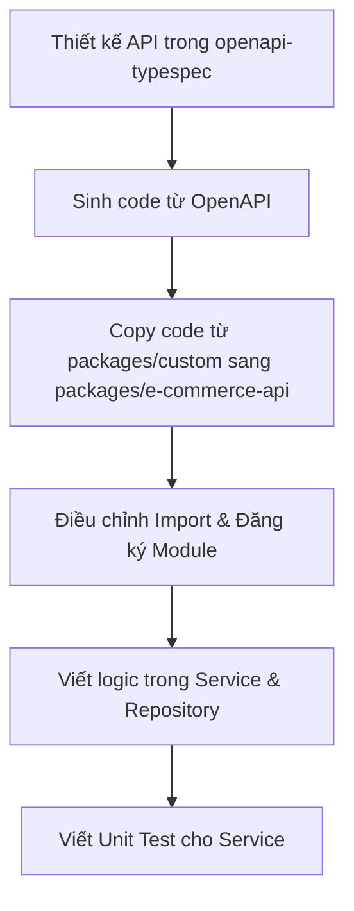

## 1. Tổng quan (Overview)

Tài liệu này hướng dẫn quy trình phát triển CRUD phía Backend trong package `e-commerce-api`. Dự án tuân thủ nghiêm ngặt mô hình **API-First**, trong đó OpenAPI/TypeSpec là nguồn đáng tin cậy duy nhất (Single Source of Truth). Controller không được viết trực tiếp mà sẽ được sinh tự động từ định nghĩa API.

---

## 2. Quy trình phát triển CRUD

Quy trình chuẩn gồm các bước sau:



### Bước 1: Sinh Controller tự động
Chạy script sau tại thư mục root hoặc thư mục `packages/e-commerce-api`:
```bash
# Chạy từ root dự án
pnpm --filter e-commerce-api generate:controllers

# Hoặc chạy từ packages/e-commerce-api
pnpm run generate:controllers
```
Lệnh này sẽ:
- Sinh code Controller cơ sở trong thư mục `packages/e-commerce-api/generated-controller/...`.
- Sinh code khung (skeleton) mẫu cho Controller, Service, Module của bạn trong thư mục `packages/custom/...`.

### Bước 2: Sao chép thư mục mẫu sang thư mục code chính
Sao chép thư mục API tương ứng từ `packages/custom/...` sang `packages/e-commerce-api/src/api/v1/...`.

*Ví dụ:* Nếu bạn phát triển API liên quan đến `cart-items` nằm trong `packages/custom/cart/cart-items`, hãy sao chép toàn bộ thư mục đó thành `packages/e-commerce-api/src/api/v1/cart/cart-items`.

### Bước 3: Điều chỉnh Import & Cấu trúc Module
Do thư mục `custom` sử dụng các import tương đối giả định, bạn cần thực hiện các điều chỉnh sau:

1. **Cập nhật Controller Interface Import trong Controller và Service:**
   - Thay đổi từ:
     ```ts
     import type { BaseCartItemsControllerInterface } from '@generated-controller/base-cart-items.controller.interface';
     ```
   - Thành đường dẫn chính xác trong `generated-controller`:
     ```ts
     import type { BaseCartItemsControllerInterface } from '@generated-controller/cart/cart-items/base-cart-items.controller.interface';
     ```

2. **Cập nhật Base Controller Import trong Module:**
   - Thay đổi từ:
     ```ts
     import { BaseCartItemsController, CART_ITEMS_CONTROLLER } from '@generated-controller/base-cart-items.controller';
     ```
   - Thành:
     ```ts
     import { BaseCartItemsController, CART_ITEMS_CONTROLLER } from '@generated-controller/cart/cart-items/base-cart-items.controller';
     ```

3. **Khai báo Repository:**
   Tạo file Repository (ví dụ: `cart-items.repository.ts`) để đóng gói các thao tác cơ sở dữ liệu với Prisma, thay vì gọi trực tiếp Prisma từ Service.

4. **Đăng ký các provider trong Module:**
   Đăng ký `BaseCartItemsController` vào danh sách `controllers`. Đăng ký `CartItemsService`, `CartItemsRepository` và bind `CartItemsController` vào token `CART_ITEMS_CONTROLLER` trong phần `providers`.

---

## 3. Ví dụ mẫu: Cart Items API (`/packages/e-commerce-api/src/api/v1/cart/cart-items`)

Dưới đây là mã nguồn thực tế của module `cart-items` làm hình mẫu tham chiếu:

### 3.1. Module (`cart-items.module.ts`)
```typescript
import { Module } from '@nestjs/common';
import { CartItemsController } from './cart-items.controller';
import { CartItemsService } from './cart-items.service';
import {
  BaseCartItemsController,
  CART_ITEMS_CONTROLLER,
} from '@generated-controller/cart/cart-items/base-cart-items.controller';
import { CartItemsRepository } from '@/api/v1/cart/cart-items/cart-items.repository';

@Module({
  controllers: [BaseCartItemsController],
  providers: [
    CartItemsService,
    {
      provide: CART_ITEMS_CONTROLLER,
      useClass: CartItemsController,
    },
    CartItemsRepository,
  ],
})
export class CartItemsModule {}
```

### 3.2. Controller (`cart-items.controller.ts`)
```typescript
import { Injectable } from '@nestjs/common';
import { CartItemsService } from './cart-items.service';
import type {
  DeleteCartItemParams,
  GetCartItemsParams,
  GetCartItems200Response,
  PatchCartItemParams,
  PatchCartItemBody,
  PostCartItemParams,
  PostCartItemBody,
  PostCartItem201Response,
} from '@e-commerce/api-validation/types/cart';
import { BaseCartItemsControllerInterface } from '@generated-controller/cart/cart-items/base-cart-items.controller.interface';

@Injectable()
export class CartItemsController implements BaseCartItemsControllerInterface {
  constructor(private readonly service: CartItemsService) {}

  async deleteCartItem(params: DeleteCartItemParams): Promise<void> {
    await this.service.deleteCartItem(params);
  }

  async getCartItems(params: GetCartItemsParams): Promise<GetCartItems200Response> {
    return await this.service.getCartItems(params);
  }

  async patchCartItem(params: PatchCartItemParams, body: PatchCartItemBody): Promise<void> {
    await this.service.patchCartItem(params, body);
  }

  async postCartItem(params: PostCartItemParams, body: PostCartItemBody): Promise<PostCartItem201Response> {
    return await this.service.postCartItem(params, body);
  }
}
```

### 3.3. Service (`cart-items.service.ts`)
```typescript
import { Injectable } from '@nestjs/common';
import type {
  DeleteCartItemParams,
  GetCartItemsParams,
  GetCartItems200Response,
  PatchCartItemParams,
  PatchCartItemBody,
  PostCartItemParams,
  PostCartItemBody,
  PostCartItem201Response,
} from '@e-commerce/api-validation/types/cart';
import type { BaseCartItemsControllerInterface } from '@generated-controller/cart/cart-items/base-cart-items.controller.interface';
import { CartItemsRepository } from '@/api/v1/cart/cart-items/cart-items.repository';

@Injectable()
export class CartItemsService implements BaseCartItemsControllerInterface {
  constructor(private readonly cartItemsRepository: CartItemsRepository) {}

  async deleteCartItem(params: DeleteCartItemParams): Promise<void> {
    await this.cartItemsRepository.deleteCartItem(
      params.cartId,
      params.productVariantId,
    );
  }

  async getCartItems(params: GetCartItemsParams): Promise<GetCartItems200Response> {
    return await this.cartItemsRepository.getCartItems(params.cartId);
  }

  async patchCartItem(params: PatchCartItemParams, body: PatchCartItemBody): Promise<void> {
    await this.cartItemsRepository.updateCartItem(
      params.cartId,
      params.productVariantId,
      body,
    );
  }

  async postCartItem(params: PostCartItemParams, body: PostCartItemBody): Promise<PostCartItem201Response> {
    const result = await this.cartItemsRepository.createCartItem(
      params.cartId,
      body,
    );
    return result;
  }
}
```

### 3.4. Repository (`cart-items.repository.ts`)
```typescript
import { PrismaService } from '@/common/services/prisma.service';
import {
  GetCartItems200Response,
  PatchCartItemBody,
  PostCartItemBody,
} from '@e-commerce/api-validation/types/cart';
import { Injectable, NotFoundException } from '@nestjs/common';
import { PrismaClientKnownRequestError } from '@prisma/client/runtime/client';

@Injectable()
export class CartItemsRepository {
  constructor(private readonly prisma: PrismaService) {}

  async deleteCartItem(cartId: string, productVariantId: string): Promise<void> {
    try {
      await this.prisma.cart_items.delete({
        where: {
          cart_id_product_variant_id: {
            cart_id: cartId,
            product_variant_id: productVariantId,
          },
        },
      });
    } catch (error) {
      if (
        error instanceof PrismaClientKnownRequestError &&
        error.code === 'P2025'
      ) {
        throw new NotFoundException('Cart Item not found');
      }
      throw error;
    }
  }

  async getCartItems(cartId: string): Promise<GetCartItems200Response> {
    const itemsResult = await this.prisma.cart_items.findMany({
      where: { cart_id: cartId },
    });

    const cartItems = itemsResult.map((item) => ({
      cartId: item.cart_id,
      productVariantId: item.product_variant_id,
      quantity: item.quantity || 0,
    }));

    return { cartItems };
  }

  async updateCartItem(
    cartId: string,
    productVariantId: string,
    data: PatchCartItemBody,
  ): Promise<void> {
    await this.prisma.cart_items.update({
      where: {
        cart_id_product_variant_id: {
          cart_id: cartId,
          product_variant_id: productVariantId,
        },
      },
      data: {
        quantity: data.quantity,
      },
    });
  }

  async createCartItem(
    cartId: string,
    data: PostCartItemBody,
  ): Promise<{ cartId: string; productVariantId: string }> {
    const existing = await this.prisma.cart_items.findUnique({
      where: {
        cart_id_product_variant_id: {
          cart_id: cartId,
          product_variant_id: data.productVariantId,
        },
      },
    });

    if (existing) {
      await this.prisma.cart_items.update({
        where: {
          cart_id_product_variant_id: {
            cart_id: cartId,
            product_variant_id: data.productVariantId,
          },
        },
        data: {
          quantity: (existing.quantity || 0) + (data.quantity || 1),
        },
      });
    } else {
      await this.prisma.cart_items.create({
        data: {
          cart_id: cartId,
          product_variant_id: data.productVariantId,
          quantity: data.quantity || 1,
        },
      });
    }

    return {
      cartId: cartId,
      productVariantId: data.productVariantId,
    };
  }
}
```

---

## 4. Kiểm thử Service (Service Unit Testing)

Tất cả các Service nghiệp vụ phải có Unit Test đi kèm sử dụng Jest. Unit Test cần giả lập (mock) `Repository` và `PrismaService`.

### 4.1. Ví dụ mẫu: Test Service (`cart-items.service.spec.ts`)
```typescript
import { Test, TestingModule } from '@nestjs/testing';
import { CartItemsService } from './cart-items.service';
import { CartItemsRepository } from './cart-items.repository';
import type {
  PatchCartItemBody,
  PostCartItemBody,
} from '@e-commerce/api-validation/types/cart';

jest.mock('@/common/services/prisma.service', () => ({
  PrismaService: jest.fn().mockImplementation(() => ({
    cart_items: {
      findMany: jest.fn(),
      findUnique: jest.fn(),
      create: jest.fn(),
      update: jest.fn(),
      delete: jest.fn(),
    },
  })),
}));

jest.mock('./cart-items.repository');

const cartId = '123e4567-e89b-12d3-a456-426614174400';
const productVariantId = '123e4567-e89b-12d3-a456-426614174100';

const mockCartItem = {
  cartId,
  productVariantId,
  quantity: 2,
};

const mockCartItemsResponse = {
  cartItems: [mockCartItem],
};

describe('CartItemsService', () => {
  let service: CartItemsService;
  let repository: jest.Mocked<CartItemsRepository>;

  beforeEach(async () => {
    const module: TestingModule = await Test.createTestingModule({
      providers: [CartItemsService, CartItemsRepository],
    }).compile();

    service = module.get<CartItemsService>(CartItemsService);
    repository = module.get(CartItemsRepository);

    jest.clearAllMocks();
  });

  describe('deleteCartItem', () => {
    it('should call repository.deleteCartItem with correct params', async () => {
      repository.deleteCartItem.mockResolvedValue(undefined);

      await service.deleteCartItem({ cartId, productVariantId });

      expect(repository.deleteCartItem).toHaveBeenCalledTimes(1);
      expect(repository.deleteCartItem).toHaveBeenCalledWith(
        cartId,
        productVariantId,
      );
    });
  });

  describe('getCartItems', () => {
    it('should return items from repository', async () => {
      repository.getCartItems.mockResolvedValue(mockCartItemsResponse);

      const result = await service.getCartItems({ cartId });

      expect(repository.getCartItems).toHaveBeenCalledTimes(1);
      expect(repository.getCartItems).toHaveBeenCalledWith(cartId);
      expect(result).toEqual(mockCartItemsResponse);
    });
  });

  describe('patchCartItem', () => {
    const body: PatchCartItemBody = {
      quantity: 5,
    };

    it('should call repository.updateCartItem with correct params', async () => {
      repository.updateCartItem.mockResolvedValue(undefined);

      await service.patchCartItem({ cartId, productVariantId }, body);

      expect(repository.updateCartItem).toHaveBeenCalledTimes(1);
      expect(repository.updateCartItem).toHaveBeenCalledWith(
        cartId,
        productVariantId,
        body,
      );
    });
  });

  describe('postCartItem', () => {
    const body: PostCartItemBody = {
      productVariantId,
      quantity: 2,
    };

    it('should return IDs after creation', async () => {
      repository.createCartItem.mockResolvedValue({ cartId, productVariantId });

      const result = await service.postCartItem({ cartId }, body);

      expect(repository.createCartItem).toHaveBeenCalledTimes(1);
      expect(repository.createCartItem).toHaveBeenCalledWith(cartId, body);
      expect(result).toEqual({ cartId, productVariantId });
    });
  });
});
```

---

## 5. Quy tắc quan trọng cần nhớ
1. ⚠️ **Không tự ý sửa đổi code của Controller được sinh trong `generated-controller`**.
2. ⚠️ **Không viết logic kiểm tra (validation) nghiệp vụ trùng lặp trong Controller**, sử dụng các pipe validation sinh sẵn từ OpenAPI (ZodValidationPipe).
3. ⚠️ **Sử dụng JSDoc đầy đủ** cho toàn bộ các phương thức trong Service và Repository.
4. ⚠️ **Tuyệt đối không bỏ qua bước viết unit test cho Service**. Đảm bảo độ bao phủ (coverage) tốt trước khi gửi Pull Request.
