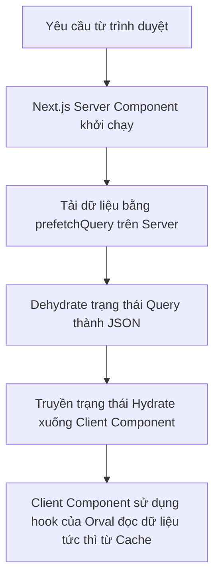

## 1. Tổng quan (Overview)

Tài liệu này hướng dẫn quy trình phát triển các trang **Server-Side Rendering (SSR)** cho các API công khai (Public APIs) phía Frontend nằm trong package `packages/e-commerce-front`. SSR là kỹ thuật cực kỳ quan trọng đối với các trang người dùng cuối (trang chủ, danh sách sản phẩm, chi tiết sản phẩm, vv.) vì nó cho phép các công cụ tìm kiếm thu thập dữ liệu dễ dàng (chuẩn SEO) và mang lại tốc độ tải trang ban đầu tối ưu cho người dùng.

---

## 2. Mô hình SSR với TanStack Query và Next.js

Dự án áp dụng mô hình **Prefetch & Dehydrate** thông qua các bước phối hợp giữa Server Component và Client Component:



---

## 3. Quy trình từng bước thực hiện SSR

### Bước 1: Định nghĩa Async Server Component
Tạo hoặc sửa file trang của Next.js thành một `async` component để có thể chạy các tác vụ bất đồng bộ trên Server. Nhận tham số `searchParams` nếu trang có các bộ lọc tìm kiếm hoặc phân trang.

```typescript
const Page = async ({ searchParams }: PageProps<"/route-path">) => {
  // logic prefetching ở đây...
}
```

### Bước 2: Tạo Query Client trên Server
Sử dụng hàm `getQueryClient()` từ `@/utils/query`. Trên môi trường Server, hàm này luôn khởi tạo một instance `QueryClient` mới và riêng biệt cho mỗi request của người dùng để tránh rò rỉ dữ liệu giữa các phiên truy cập.

```typescript
import { getQueryClient } from "@/utils/query";
const queryClient = getQueryClient();
```

### Bước 3: Đọc và phân tích tham số tìm kiếm (Search Params)
Nếu API yêu cầu các tham số truy vấn (query parameters), ta phải phân tích chúng từ URL trên Server.
- Giải quyết (resolve) promise `searchParams`.
- Sử dụng hàm `parseSearchParams` cùng với Zod schema tương ứng được sinh ra ở `@e-commerce/api-validation/zod/[feature]`.

```typescript
import { parseSearchParams } from "@/providers/SearchProvider/utils";
import { getProductsQueryParams } from "@e-commerce/api-validation/zod/product";

const rawParams = await searchParams;
const params = parseSearchParams(
  new URLSearchParams(rawParams as Record<string, string>),
  getProductsQueryParams,
);
```

### Bước 4: Tải trước dữ liệu (Prefetch) trên Server
Sử dụng phương thức `queryClient.prefetchQuery` để gọi API và lưu kết quả vào bộ nhớ cache trên Server trước khi trả HTML về trình duyệt.
- Dùng khóa truy vấn (`queryKey`) và hàm gọi API (`queryFn`) được sinh tự động bởi Orval từ thư viện `@e-commerce/api-client/endpoints/[feature]`.

```typescript
import { getProducts, getGetProductsQueryKey } from "@e-commerce/api-client/endpoints/product";

await queryClient.prefetchQuery({
  queryKey: getGetProductsQueryKey(params),
  queryFn: () => getProducts(params),
});
```

### Bước 5: Đóng gói và Hydrate dữ liệu xuống Client
Bao bọc component hiển thị của Client bên trong component `<Hydration>` và truyền trạng thái đã được dehydrate:

```typescript
import Hydration from "@/components/ssr/Hydration/Hydration";
import { dehydrate } from "@tanstack/react-query";

return (
  <Hydration state={dehydrate(queryClient)}>
    <ClientComponent />
  </Hydration>
);
```

---

## 4. Các ví dụ mẫu tham chiếu (Reference Code)

### 4.1. Ví dụ mẫu 1: Category SSR Component (`CategoryContent.tsx`)
*Đây là ví dụ mẫu hoàn chỉnh được thiết lập cho thực tế sử dụng:*

```typescript
import Hydration from "@/components/ssr/Hydration/Hydration";
import CategoryGrid from "@/features/admin/category/components/CategoryGrid/CategoryGrid";
import { parseSearchParams } from "@/providers/SearchProvider/utils";
import { getQueryClient } from "@/utils/query";
import {
  getCategories,
  getGetCategoriesQueryKey,
} from "@e-commerce/api-client/endpoints/product";
import { getCategoriesQueryParams } from "@e-commerce/api-validation/zod/product";
import { dehydrate } from "@tanstack/react-query";

const CategoryContent = async ({
  searchParams,
}: PageProps<"/admin/category">) => {
  const queryClient = getQueryClient();

  const rawParams = await searchParams;

  // Phân tích searchParams trên server bằng schema của Zod
  const params = parseSearchParams(
    new URLSearchParams(rawParams as Record<string, string>),
    getCategoriesQueryParams,
  );

  // Gọi trước dữ liệu trên server
  await queryClient.prefetchQuery({
    queryKey: getGetCategoriesQueryKey(params),
    queryFn: () => getCategories(params),
  });

  return (
    <Hydration state={dehydrate(queryClient)}>
      <CategoryGrid />
    </Hydration>
  );
};

export default CategoryContent;
```

### 4.2. Ví dụ mẫu 2: Product SSR Page (`product/page.tsx`)
*Ví dụ cấu hình cho trang danh sách sản phẩm công khai dành cho SEO:*

```typescript
import Hydration from "@/components/ssr/Hydration/Hydration";
import ProductList from "@/features/main/components/ProductList/ProductList";
import { parseSearchParams } from "@/providers/SearchProvider/utils";
import { getQueryClient } from "@/utils/query";
import { getProducts, getGetProductsQueryKey } from "@e-commerce/api-client/endpoints/product";
import { getProductsQueryParams } from "@e-commerce/api-validation/zod/product";
import { dehydrate } from "@tanstack/react-query";

const ProductPage = async ({ searchParams }: PageProps<"/product">) => {
  const queryClient = getQueryClient();
  const rawParams = await searchParams;

  const params = parseSearchParams(
    new URLSearchParams(rawParams as Record<string, string>),
    getProductsQueryParams,
  );

  await queryClient.prefetchQuery({
    queryKey: getGetProductsQueryKey(params),
    queryFn: () => getProducts(params),
  });

  return (
    <Hydration state={dehydrate(queryClient)}>
      <ProductList />
    </Hydration>
  );
};

export default ProductPage;
```

---

## 5. Quy tắc quan trọng cần nhớ
1. ⚠️ **Tuyệt đối không sử dụng các React hooks phía client** (như `useState`, `useEffect`, `useContext`) hoặc các thao tác trực tiếp lên DOM trong Server Component.
2. ⚠️ **Phải sử dụng đúng `queryKey` và `queryFn`**: Khóa truy vấn (`queryKey`) dùng để prefetch trên Server phải trùng khớp hoàn toàn với khóa truy vấn mà Client component sử dụng để lấy dữ liệu từ bộ nhớ đệm (cache), nếu lệch nhau Client sẽ phải gọi lại API một lần nữa qua mạng.
3. ⚠️ **Bao bọc an toàn**: Đảm bảo toàn bộ các client component cần truy cập dữ liệu đã prefetch đều nằm bên trong thẻ bọc `<Hydration>`.
4. ⚠️ **Xử lý tham số an toàn**: Luôn parse search parameters bằng `parseSearchParams` trước khi gửi lên API để tránh lỗi bất đồng bộ và định dạng dữ liệu không hợp lệ.
